<div align="center">
<table>
    <theader>
        <tr>
            <td></td>
            <th>
                <span style="font-weight:bold;">UNIVERSIDAD NACIONAL DE SAN AGUSTIN</span><br />
                <span style="font-weight:bold;">FACULTAD DE INGENIERÍA DE PRODUCCIÓN Y SERVICIOS</span><br />
                <span style="font-weight:bold;">ESCUELA PROFESIONAL DE INGENIERÍA DE SISTEMAS</span>
            </th>
            <td></td>
        </tr>
    </theader>
    <tbody>
        <tr><td colspan="3"><span style="font-weight:bold;">Formato</span>: Guía de Práctica de Laboratorio / Talleres / Centros de Simulación</td></tr>
        <tr><td><span style="font-weight:bold;">Aprobación</span>:  2022/03/01</td><td><span style="font-weight:bold;">Código</span>: GUIA-PRLD-001</td><td><span style="font-weight:bold;">Página</span>: 1</td></tr>
    </tbody>
</table>
</div>

<div>
<span style="font-weight:bold;">INFORME DE LABORATORIO</span><br />

<table>
<theader>
<tr><th colspan="6">INFORMACIÓN BÁSICA</th></tr>
</theader>
<tbody>
<tr><td>ASIGNATURA:</td><td colspan="5">Estructura de Datos y Algoritmos</td></tr>
<tr><td>TÍTULO DE LA PRÁCTICA:</td><td colspan="5">Árboles</td></tr>
<tr>
<td>NÚMERO DE PRÁCTICA:</td><td>05</td><td>AÑO LECTIVO:</td><td>2022 A</td><td>NRO. SEMESTRE:</td><td>III</td>
</tr>
<tr>
<td>FECHA DE PRESENTACIÓN:</td><td>29/06/2022</td><td>HORA DE PRESENTACIÓN:</td><td colspan="3"></td>
</tr>
<tr><td colspan="3">INTEGRANTE(s):
<ul>
<li>Cárdenas Martínez Franco Luchiano - fcardenasm@unsa.edu.pe</li>
<li>Carrillo Daza Barbara Rubi - bcarrillo@unsa.edu.pe</li>
<li>Diaz Portilla Carlo Rodrigo - cdiazpor@unsa.edu.pe</li>
<li>Hancco Condori Bryan Orlando - bhanccoco@unsa.edu.pe</li>
<li>Mamani Cañari Gabriel Anthony - gmamanican@unsa.edu.pe</li>
</ul>
</td>
<td>NOTA:</td><td colspan="2"></td>
</<tr>
<tr><td colspan="6">DOCENTE(s):
<ul>
<li>Richart Smith Escobedo Quispe - rescobedoq@unsa.edu.pe</li>
</ul>
</td>
</<tr>
</tbody>
</table>

<!-- Reportes -->
## SOLUCIÓN Y RESULTADOS
  
---

I. SOLUCIÓN DE EJERCICIOS/PROBLEMAS <br>
* La organización del repositorio es la siguiente
    ```sh
    .
    ├── Ejercicio01
    │   ├── ExceptionIsEmpty.java
    │   ├── Node.java
    │   ├── Stack.java
    │   ├── StackLink.java
    │   └── Test.java
    ├── Ejercicio02Graficas
    │   ...	
    │   └── graficas
    ├── Ejercicio03
    │   ├── AVL.java
    │   ├── ItemDuplicated.java
    │   ├── ItemNotFound.java
    │   └── Test.java
    └── README.md
    ```
  * **Nota :** Para los Ejercicios 1 y 3 se debera compilar y ejecutar "Test.java".
* **Ejercicio 1:** Corchetes equilibrados
	
  Para este ejercicio se implemento un Stack, por su modo de acceso a los datos LIFO. Por otro lado para la determinacion de el balance de las cadenas de corchetes se considero el siguiente metodo.
  ```java
  public static String isBalanced(String s) throws ExceptionIsEmpty{
    if(s == null || s.isEmpty() || s.length()%2 == 1) return "NO"; // casos obvios NO
    StackLink<Character> stack = new StackLink<>();
    int i = 0;
    //bucle para insertar en el stack 	
    while(i < s.length() && !isNegative(s.charAt(i))){ 
      stack.push(s.charAt(i++));
    }    
    while(i < s.length() && !stack.isEmpty() && arePairs(stack.top(), s.charAt(i++))){ 
      stack.pop(); // si tiene pareja se elimina en este bucle	
    }
    //stack vacio y ya se itero la cadena completa es SI
    if(stack.isEmpty() && i == s.length()) return "SI"; 
    return "NO";					     		
  }
  ```    
* **Ejercicio 2:** Operaciones de árbol AVL

  Para el ejercicio 2 se simuló las siguientes operaciones realizadas en un árbol AVL.

  Insert: 100 - 200 - 300 - 400 - 500 - 50 - 25 - 350 - 375 - 360 - 355 - 150 - 175 - 120 - 190

  Delete: 100 - 200 - 300 - 400 - 500 - 50 - 25 - 350 - 375 - 360 - 355 - 150 - 175 - 120 - 190

  * **Operaciones Insert**
  * insert(**100**)
  
    En el primer <code>insert</code> se reconoce que el árbol AVL está vacío, entonces insertamos el primer elemento y será nuestro <code>root</code> del árbol.

    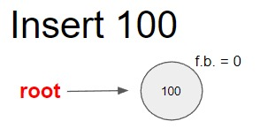

  * insert(**200**)
  
    Cuando se inserta 200 el factor de equilibrio (f.b.) de la raíz será igual a 1, notando que el árbol está inclinado a la derecha. Pero debido a que no estamos en valores críticos como -2 o 2, no se produce balance y continuamos.

    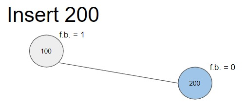

  * insert(**300**)
  
    Cuando se inserta 300 notamos que se produce un desequilibrio a la derecha, cuando se actualizan los factores de equilibrio se llega a 2, pero para equilibrar el árbol solo será necesario una <code>rotacionSimpleIzquierda()</code>.

    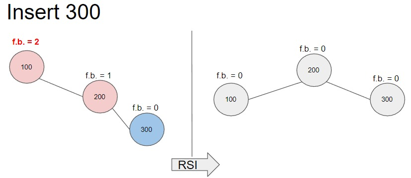

  * insert(**400**)
  
    Cuando se inserta 400 el árbol se inclina a la derecha con factores de balance de 1, entonces no es necesario balancear.

    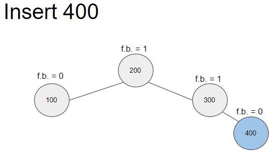

  * insert(**500**)
  
    Cuando se inserta 500 se produce un desequilibrio a la derecha con factores de balance de 2, para equilibrar el árbol solo será necesario una <code>rotacionSimpleIzquierda()</code>.

    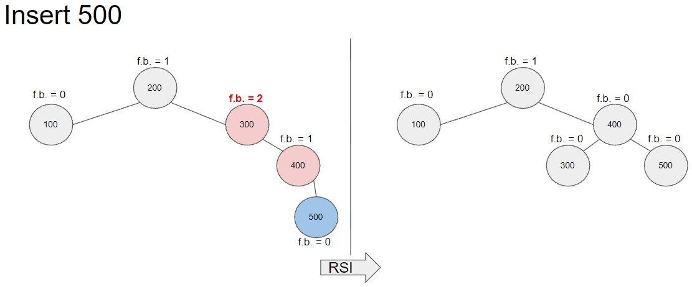

  * insert(**50**)
  
    Cuando se inserta 50 se producen cambios de factores de balance a la izquierda de -1, pero no es necesario balancear el árbol.

    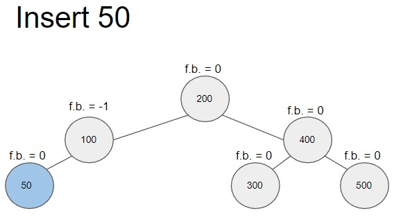

  * insert(**25**)
  
    Cuando se inserta 25 se produce un desequilibrio a la izquierda, resultando en factores de balance de -2, entonces es necesario equilibrar. Para este caso notamos que los factores de balance son -2 y luego -1, entonces necesitaremos aplicar una <code>rotacionSimpleDerecha()</code> para equilibrar el árbol.
    
    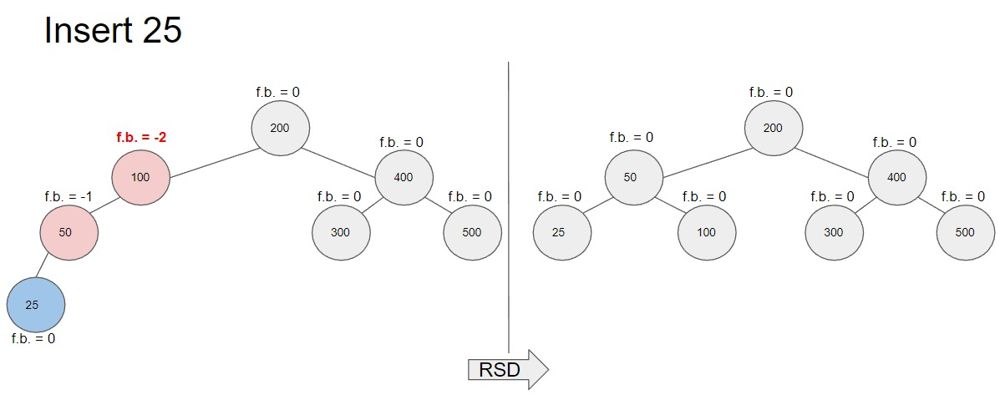

  * insert(**350**)
  
    Cuando se inserta 350 el árbol se inclina a la derecha, los factores de balance cambian a 1 pero no es necesario equilibrar.
    
    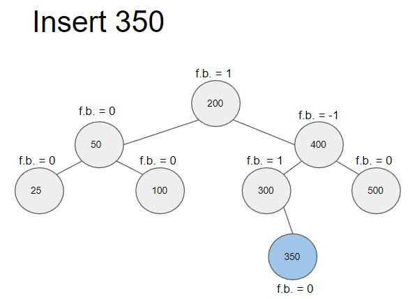

  * insert(**375**)
  
    Cuando se inserta 375 el árbol no está equilibrado. Analizando los factores de balance 2 y 1 sabemos que tenemos que aplicar una <code>rotacionSimpleIzquierda()</code>.
    
    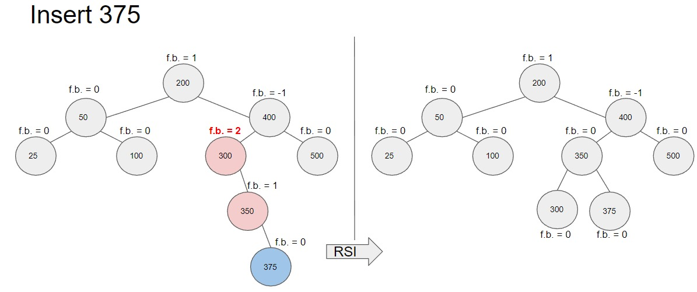

  * insert(**360**)
  
    Cuando se inserta 360 se produce un desequilibrio en el árbol, pero en este caso notamos que los factores de balance son -2 y 1, esto nos indica que tenemos que hacer una rotación doble. Para equilibrar este árbol tenemos que realizar una <code>rotacionDobleDerecha()</code> que consiste en realizar primero una <code>rotacionSimpleIzquierda()</code> y luego una <code>rotacionSimpleDerecha()</code>.
    
    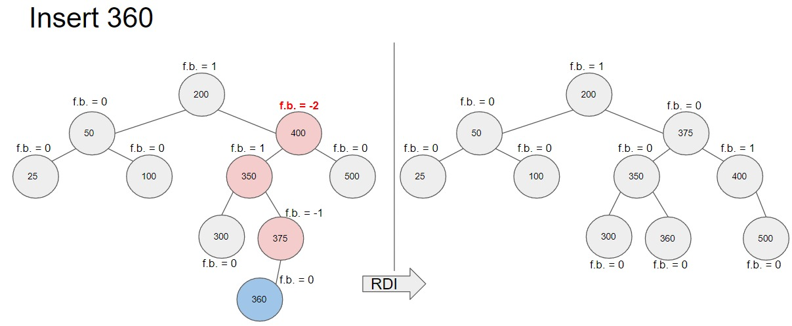

  * insert(**355**)
  
    Cuando se inserta 355 y se actualizan los factores de balance nos resulta en 2 y -1, entonces para equilibrar este árbol se tiene aplicar una <code>rotacionDobleIzquierda()</code> que sería el resultado de hacer una <code>rotacionSimpleDerecha()</code> y una <code>rotacionSimpleIzquierda()</code>.
    
    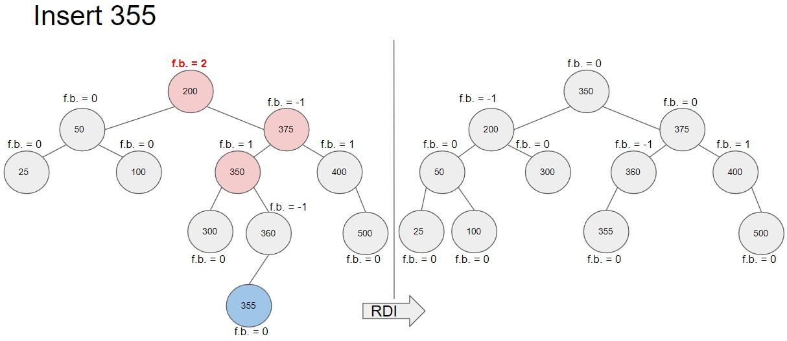

  * insert(**150**)
  
    Cuando se inserta el 150 el árbol no está equilibrado debido a los factores de balance -2 y 1, para equilibrar este árbol se aplica una <code>rotacionDobleDerecha()</code>.
    
    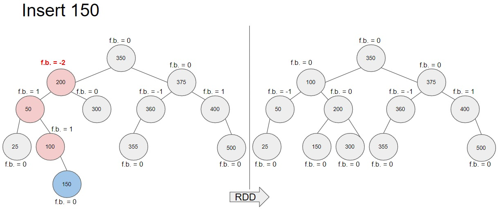

  * insert(**175**)
  
    Cuando se inserta el 175 los factores de balance cambian a -1 y 1, entonces no es necesario balancear el árbol.
    
    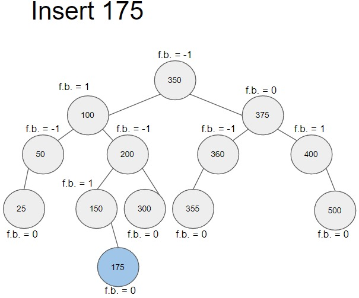

  * insert(**120**)
  
    Cuando se inserta el 120, igualmente que el caso anterior, no es necesario balancear el árbol.
    
    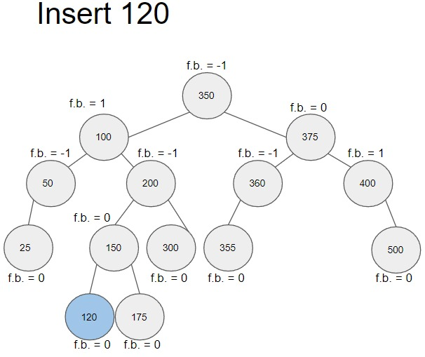

  * insert(**190**)
  
    Cuando se inserta el 190 el árbol no se encuentra equilibrado debido a los factores de balance -2 y 1, entonces para equilibrar el árbol se aplica una <code>rotacionDobleDerecha()</code>.
    
    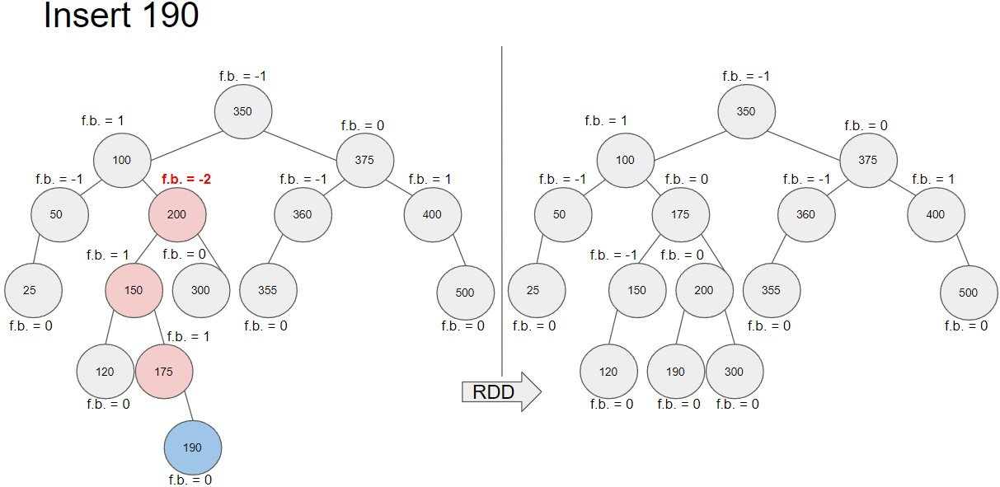


  * **Operaciones Delete**
  * delete(**100**)
  
    Cuando eliminamos el 100 notamos que tiene 2 hijos, entonces es necesario buscar el sucesor <code>in orden</code> (nodo verde) del 100, reemplazarlo y luego recién eliminarlo.
    
    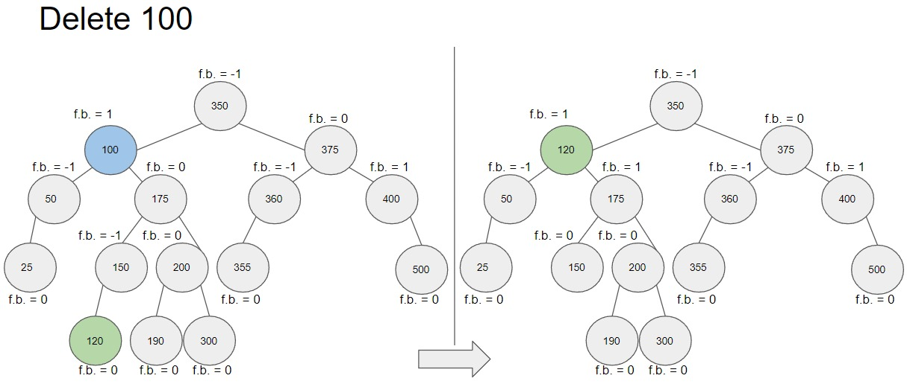

  * delete(**200**)
  
    Cuando eliminamos el 200, igual que el caso anterior, tenemos que buscar el sucesor (nodo verde) y reemplazarlo, entonces el nodo recién se elimina.
    
    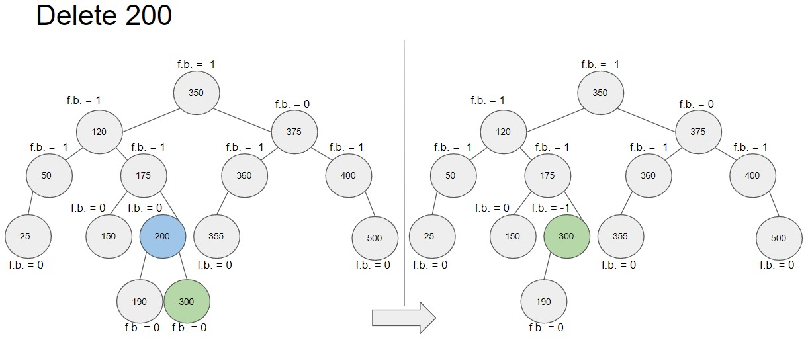

  * delete(**300**)
  
    Cuando eliminamos el 300 notamos que solo tiene un hijo, entonces no es necesario buscar sucesores, solo conectamos el nodo hijo al padre y se elimina el nodo.
    
    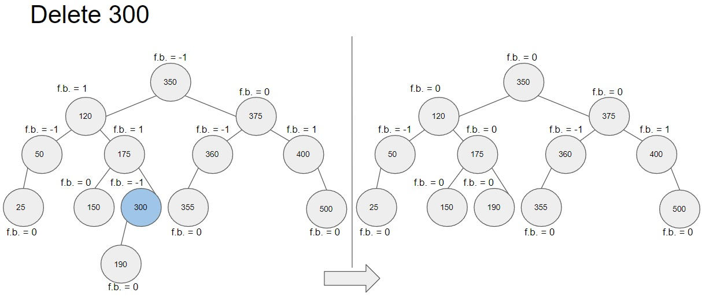

  * delete(**400**)
  
    Cuando eliminamos el 400, igual que el caso anterior, solo tiene un solo hijo, entonces lo conectamos al nodo padre y el nodo se elimina.
    
    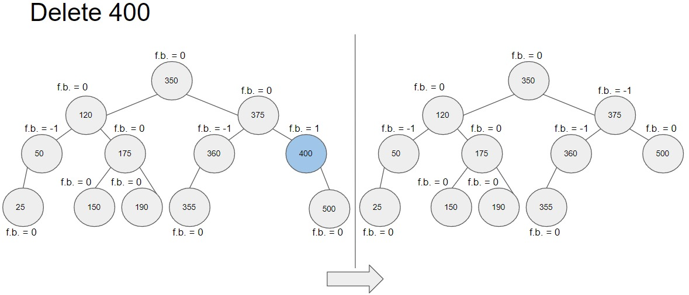

  * delete(**500**)
  
    Cuando eliminamos el 500 se produce un desequilibrio en el árbol y los factores de balance son -2 y -1 lo cual nos indica que se tiene que realizar una <code>rotacionSimpleDerecha()</code>.
    
    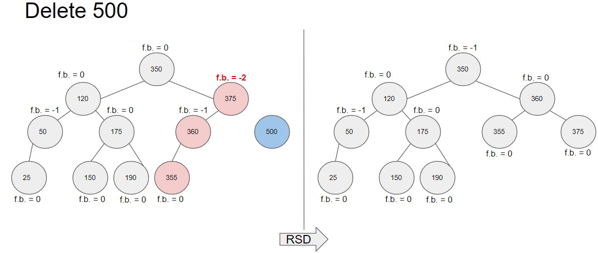

  * delete(**50**)
  
    Cuando eliminamos el 50 solo tenemos que conectar su único hijo al nodo padre para poder eliminar el nodo.
    
    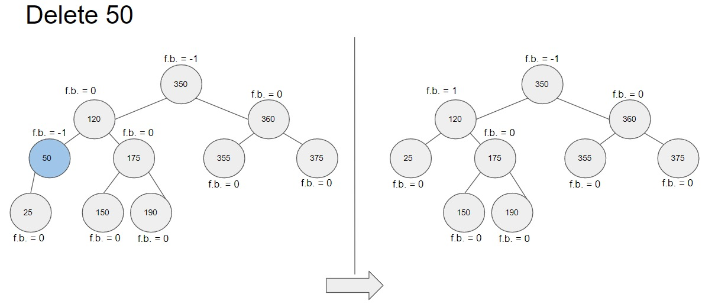

  * delete(**25**)
  
    Cuando eliminamos el 25, el árbol no está balanceado, entonces verificando los factores de balance 2 y 0 aplicamos una <code>rotacionSimpleIzquierda()</code>.
    
    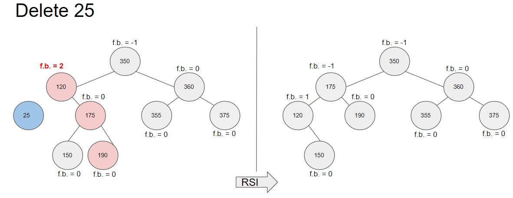

  * delete(**350**)
  
    Cuando eliminamos el 350 debido a que tiene dos nodos hijos tenemos que encontrar el sucesor (verde), luego reemplazarlo y eliminarlo.
    
    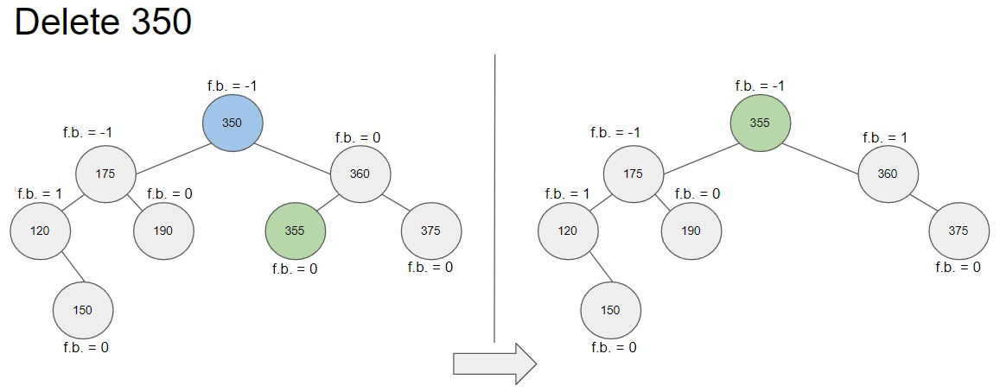

  * delete(**375**)
  
    Cuando eliminamos el 375 se produce un desequilibrio en el árbol, evaluando los factores de balance -2 y -1 tenemos que aplicar una <code>rotacionSimpleDerecha()</code>.
    
    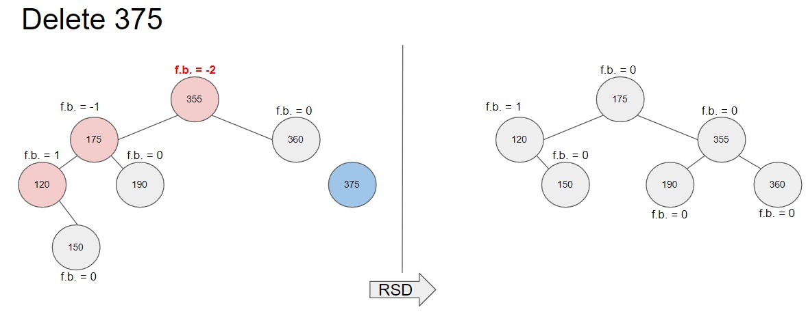

  * delete(**360**)
  
    Cuando eliminamos el 360 no hay problemas debido a que es una hoja y solo tenemos que desvincularlo.
    
    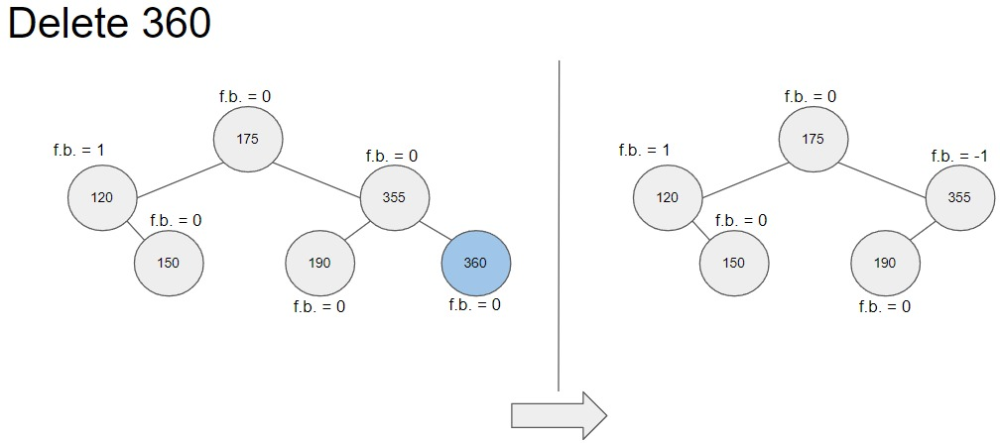

  * delete(**355**)
  
    Cuando eliminamos el 355, igual que el caso anterior, solo lo desvinculamos del nodo padre.
    
    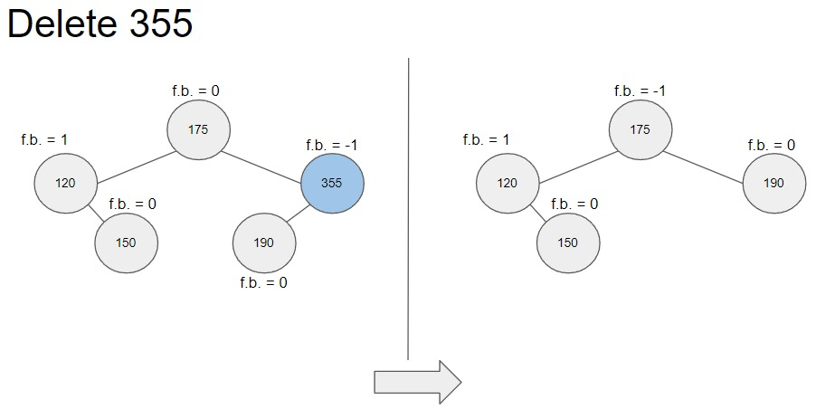

  * delete(**150**)
  
    Cuando eliminamos el 150, al ser nodo hoja solo tenemos que desvincularlo del nodo padre.
    
    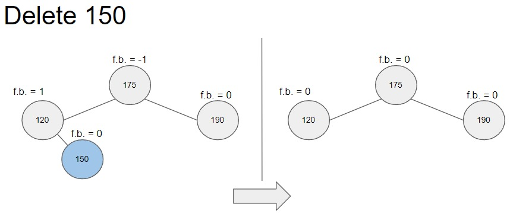

  * delete(**175**)
  
    Cuando eliminamos el 175 notamos que tiene 2 nodos hijos, entonces tenemos que buscar el sucesor (verde) y reemplazarlo.
    
    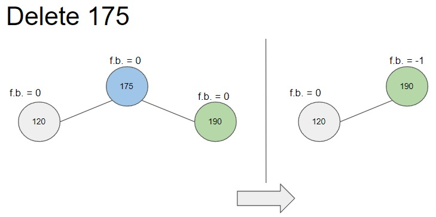

  * delete(**120**)
  
    Cuando eliminamos el 120, al ser nodo hoja solo tenemos que desvincularlo del nodo padre.
    
    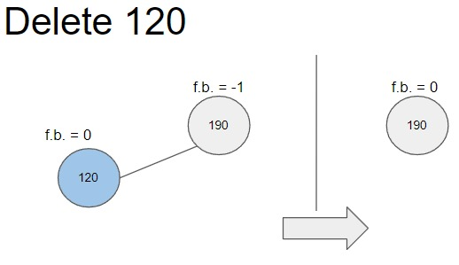

  * delete(**190**)
  
    Cuando eliminamos el 190 estamos eliminando el último elemento del árbol, por lo que el árbol AVL ya no tiene elementos.
    
    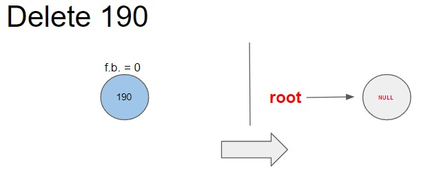


* **Ejercicio 3:** Árbol AVL
  * Para la realización del TDA, se uso la información y el código propuesto en clase de teoría, de manera que
	* La clase Node se ha escrito como parte propia de la clase AVL. Tiene los siguientes atributos
	  ```java
		  class Node {
		     protected E data;	//Datos
		     protected Node left;	//leftNode
		     protected Node right;	//rightNode
		     protected int fb;	//balanceFactor
		     ...
		  }
	  ```
	* La clase AVL, propiamente tenía los siguientes atributos
	  ```java
		  public class AVL<E extends Comparable<E>> {
		     class Node {
	             ...
	      	     }
		     private Node root;	//raiz del árbol
		     private boolean height;	//booleano que verifica si se necesita alterar el fb de los nodos
		     private E lastData;	//copia del valor de un último elemento borrado
		  }
	  ```
	* Las funciones *insert()*, *search()*, *remove()*, *minRemove()* y *postOrder()* son todas recursivas
	* Pero, para la realización de este ejercicio fue de vital importancia tener los algoritmos de rotación, tanto simple como doble
	* Rotación Simple Izquierda (RSL)
	  ```java
		private Node rotateSL(Node father) {
			Node son = father.right;	//el nodo derecho de *father* se instancia en *son*
			father.right = son.left;	//el nodo derecho de *father* es ahora el nodo izquierdo del *son*   
			son.left = father;	//el nodo izquierdo de *son* es ahora *father* 
			father = son;	//*son* ahora es *father*
			return father;	//retorna a *father*
		}
	  ```
	  Se realiza un procedimiento similar en la Rotación Simple Derecha (RSR)
	* Las Rotaciones Dobles, se resuelven directamente mediante dos rotaciones simples
		* Rotación Doble Izquierda (RSL)
		  ```java
			Node son = father.left;
			father.left = rotateSL(son);
			father = rotateSR(father);
		  ```
		* Rotación Doble Derecha (RSR)
		  ```java
			Node son = father.right;
			father.right = rotateSR(son);
			father = rotateSL(father);
		  ```
	* Sin embargo, todo este proceso sería inutil si no se actualizan los factores de balance (fb), es así que, después de cada inserción y eliminación,
	  los fb de cada nodo se actualizan constantemente
	* Por ejemplo, después de insertar un elemento al lado izquierdo de un nodo cualquiera
	  ```java
		Node res = current;
		...
		res.left = insertRecursive(x, current.left);
		//una vez insertado un nodo, height es true
		if (this.height) {
			switch (res.fb) {
				//dependiendo de cada caso, fb y height se modificarán 
				case 1: res.fb = 0; this.height = false; break;	
				case 0: res.fb = -1; this.height = true; break;
				case -1:
					res = balanceToRight(res);
					this.height = false;
					break;
			}
		}
		...
	  ```
	* A su vez, cada función de balance modifica los fb de cada nodo correspondiente, realizando **despues** la rotación necesaria. Por ejemplo con BalanceToRight.
	  ```java
		private Node balanceToRight(Node father) {
			Node son = father.left;
			//cada caso corresponde a una situación pertinente, realizando las modificaciones a los fb de *father*, *son*
			//y *grandson* si hace falta.
			switch (son.fb) {
				case -1:
					father.fb = 0;
					son.fb = 0;
					father = rotateSR(father);
					break;
				case 0: 
					father.fb = -1;
					son.fb = 1;
					father = rotateSR(father);
					break;
				case 1:
					Node grandson = son.right;
					switch (grandson.fb) {
						case -1: father.fb = 1; son.fb = 0; break;
						case 0: father.fb = 0; son.fb = 0; break;
						case 1: father.fb = 0; son.fb = -1; break;
					}
					grandson.fb = 0;
					father.left = rotateSL(son);
					father = rotateSR(father);
					break;
			}
			return father;
		}
	
	  ```	
II. CONCLUSIONES
	
- Los arboles AVL son estructuras de datos útiles para almacenar y gestionar datos, en Java utilizamos datos genéricos para poder almacenar todo tipo de datos en el árbol haciendo uso de la interface Comparable.
- Las operaciones de balanceo de los árboles AVL nos ayudan a mejorar los tiempos de los algoritmos para operaciones como insert, delete, search haciendo que nuestro programa pueda ser más eficiente.
- Se puede argumentar que los AVL son uno de los tipos de BST's más ordenados y eficientes que hay, debido al orden obtenido mediante los factores de equilibrio y los procesos de rotación.

---
    
## RETROALIMENTACIÓN GENERAL
 <pre>
 
 </pre>
---
    
### REFERENCIAS Y BIBLIOGRAFÍA
<ul>
    <li>https://www.w3schools.com/java/</li>
    <li>https://www.eclipse.org/downloads/packages/release/2022-03/r/eclipse-ide-enterprise-java-and-web-developers</li>
    <li>https://algorithmtutor.com/Data-Structures/Tree/AVL-Trees/</li>
    <li>https://docs.oracle.com/javase/tutorial/java/generics/types.html</li>
</ul>
