<div align="center">
<table>
    <theader>
        <tr>
            <td></td>
            <th>
                <span style="font-weight:bold;">UNIVERSIDAD NACIONAL DE SAN AGUSTIN</span><br />
                <span style="font-weight:bold;">FACULTAD DE INGENIERÍA DE PRODUCCIÓN Y SERVICIOS</span><br />
                <span style="font-weight:bold;">ESCUELA PROFESIONAL DE INGENIERÍA DE SISTEMAS</span>
            </th>
            <td></td>
        </tr>
    </theader>
    <tbody>
        <tr><td colspan="3"><span style="font-weight:bold;">Formato</span>: Guía de Práctica de Laboratorio / Talleres / Centros de Simulación</td></tr>
        <tr><td><span style="font-weight:bold;">Aprobación</span>:  2022/03/01</td><td><span style="font-weight:bold;">Código</span>: GUIA-PRLD-001</td><td><span style="font-weight:bold;">Página</span>: 1</td></tr>
    </tbody>
</table>
</div>

<div>
<span style="font-weight:bold;">INFORME DE LABORATORIO</span><br />

<table>
<theader>
<tr><th colspan="6">INFORMACIÓN BÁSICA</th></tr>
</theader>
<tbody>
<tr><td>ASIGNATURA:</td><td colspan="5">Estructura de Datos y Algoritmos</td></tr>
<tr><td>TÍTULO DE LA PRÁCTICA:</td><td colspan="5">Árboles</td></tr>
<tr>
<td>NÚMERO DE PRÁCTICA:</td><td>05</td><td>AÑO LECTIVO:</td><td>2022 A</td><td>NRO. SEMESTRE:</td><td>III</td>
</tr>
<tr>
<td>FECHA DE PRESENTACIÓN:</td><td>29/06/2022</td><td>HORA DE PRESENTACIÓN:</td><td colspan="3"></td>
</tr>
<tr><td colspan="3">INTEGRANTE(s):
<ul>
<li>Cárdenas Martínez Franco Luchiano - fcardenasm@unsa.edu.pe</li>
<li>Carrillo Daza Barbara Rubi - bcarrillo@unsa.edu.pe</li>
<li>Diaz Portilla Carlo Rodrigo - cdiazpor@unsa.edu.pe</li>
<li>Hancco Condori Bryan Orlando - bhanccoco@unsa.edu.pe</li>
<li>Mamani Cañari Gabriel Anthony - gmamanican@unsa.edu.pe</li>
</ul>
</td>
<td>NOTA:</td><td colspan="2"></td>
</<tr>
<tr><td colspan="6">DOCENTE(s):
<ul>
<li>Richart Smith Escobedo Quispe - rescobedoq@unsa.edu.pe</li>
</ul>
</td>
</<tr>
</tbody>
</table>

<!-- Reportes -->
## SOLUCIÓN Y RESULTADOS
  
---

I. SOLUCIÓN DE EJERCICIOS/PROBLEMAS <br>
* La organización del repositorio es la siguiente
    ```sh
	.
	├── Ejercicio
	│   ├── 
	│   ├── 
	│   ├── 
	│   └── 
	├── Ejercicio
	│   ├── 
	│   ├── 
	│   ├── 
	│   └── 
	└── README.md
    ```
* **Ejercicio 1:** Corchetes equilibrados
* **Ejercicio 2:** Operaciones de árbol AVL

  Para el ejercicio 2 se simuló las siguientes operaciones realizadas en un árbol AVL.

  Insert: 100 - 200 - 300 - 400 - 500 - 50 - 25 - 350 - 375 - 360 - 355 - 150 - 175 - 120 - 190

  Delete: 100 - 200 - 300 - 400 - 500 - 50 - 25 - 350 - 375 - 360 - 355 - 150 - 175 - 120 - 190

  * **Operaciones Insert**
  * insert(**100**)
  
    En el primer <code>insert</code> se reconoce que el árbol AVL está vacío, entonces insertamos el primer elemento y será nuestro <code>root</code> del árbol.

    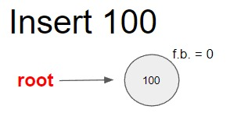

  * insert(**200**)
  
    Cuando se inserta 200 el factor de equilibrio (f.b.) de la raíz será igual a 1, notando que el árbol está inclinado a la derecha. Pero debido a que no estamos en valores críticos como -2 o 2, no se produce balance y continuamos.

    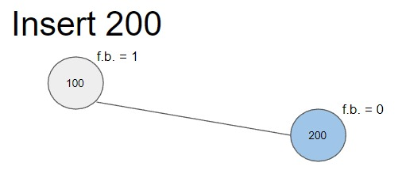

  * insert(**300**)
  
    Cuando se inserta 300 notamos que se produce un desequilibrio a la derecha, cuando se actualizan los factores de equilibrio se llega a 2, pero para equilibrar el árbol solo será necesario una <code>rotacionSimpleIzquierda()</code>.

    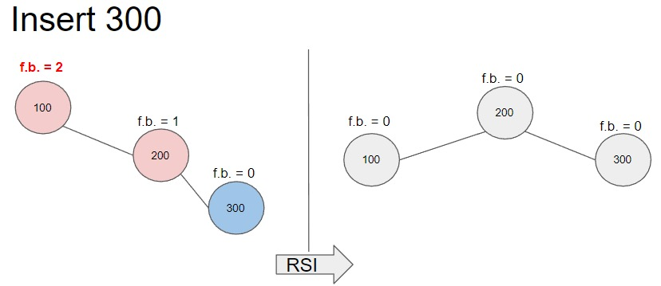

  * insert(**400**)
  
    Cuando se inserta 400 el árbol se inclina a la derecha con factores de balance de 1, entonces no es necesario balancear.

    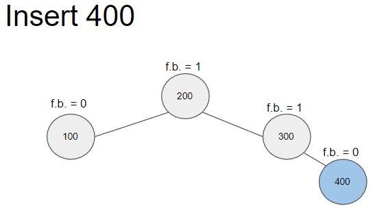

  * insert(**500**)
  
    Cuando se inserta 500 se produce un desequilibrio a la derecha con factores de balance de 2, para equilibrar el árbol solo será necesario una <code>rotacionSimpleIzquierda()</code>.

    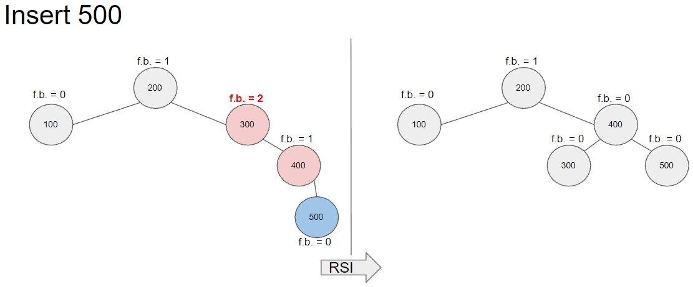

  * insert(**50**)
  
    Cuando se inserta 50 se producen cambios de factores de balance a la izquierda de -1, pero no es necesario balancear el árbol.

    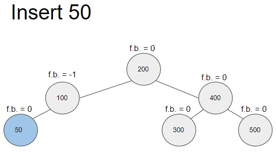

  * insert(**25**)
  
    Cuando se inserta 25 se produce un desequilibrio a la izquierda, resultando en factores de balance de -2, entonces es necesario equilibrar. Para este caso notamos que los factores de balance son -2 y luego -1, entonces necesitaremos aplicar una <code>rotacionSimpleDerecha()</code> para equilibrar el árbol.
    
    

  * insert(**350**)
  
    Cuando se inserta 350 el árbol se inclina a la derecha, los factores de balance cambian a 1 pero no es necesario equilibrar.
    
    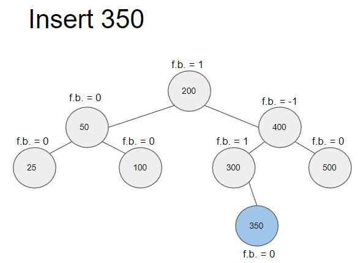

  * insert(**375**)
  
    Cuando se inserta 375 el árbol no está equilibrado. Analizando los factores de balance 2 y 1 sabemos que tenemos que aplicar una <code>rotacionSimpleIzquierda()</code>.
    
    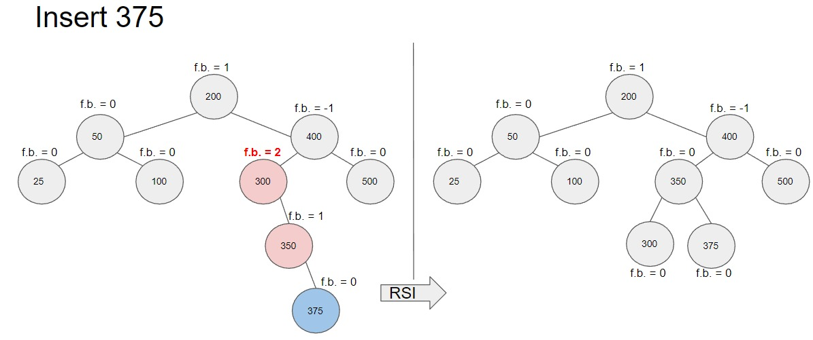

  * insert(**360**)
  
    Cuando se inserta 360 se produce un desequilibrio en el árbol, pero en este caso notamos que los factores de balance son -2 y 1, esto nos indica que tenemos que hacer una rotación doble. Para equilibrar este árbol tenemos que realizar una <code>rotacionDobleDerecha()</code> que consiste en realizar primero una <code>rotacionSimpleIzquierda()</code> y luego una <code>rotacionSimpleDerecha()</code>.
    
    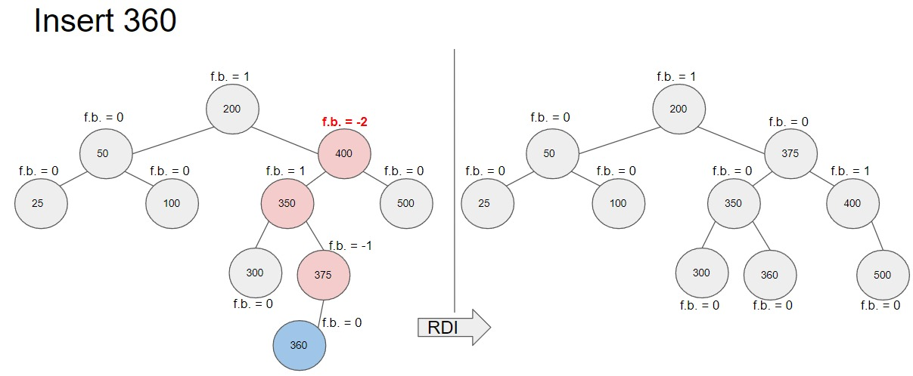

  * insert(**355**)
  
    Cuando se inserta 355 y se actualizan los factores de balance nos resulta en 2 y -1, entonces para equilibrar este árbol se tiene aplicar una <code>rotacionDobleIzquierda()</code> que sería el resultado de hacer una <code>rotacionSimpleDerecha()</code> y una <code>rotacionSimpleIzquierda()</code>.
    
    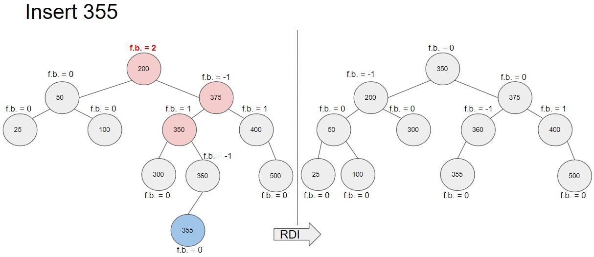

  * insert(**150**)
  
    Cuando se inserta el 150 el árbol no está equilibrado debido a los factores de balance -2 y 1, para equilibrar este árbol se aplica una <code>rotacionDobleDerecha()</code>.
    
    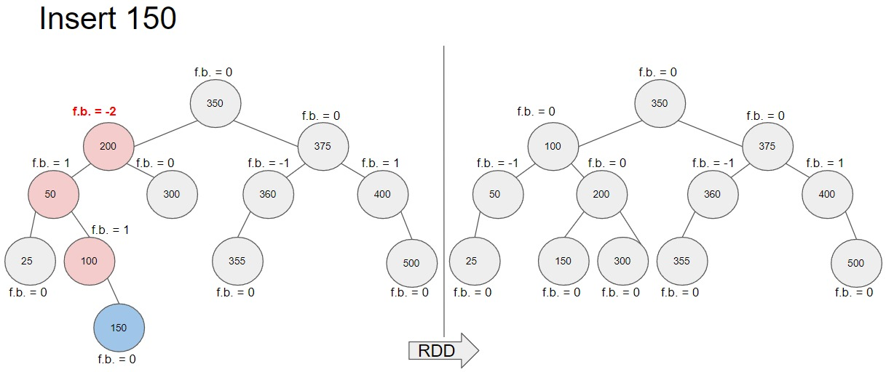

  * insert(**175**)
  
    Cuando se inserta el 175 los factores de balance cambian a -1 y 1, entonces no es necesario balancear el árbol.
    
    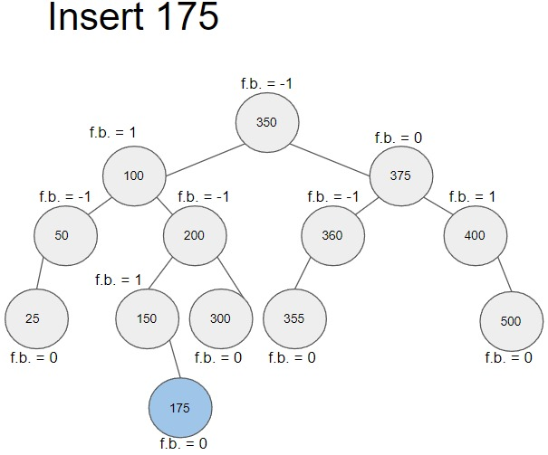

  * insert(**120**)
  
    Cuando se inserta el 120, igualmente que el caso anterior, no es necesario balancear el árbol.
    
    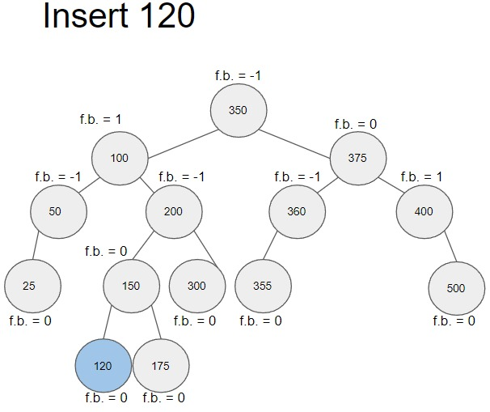

  * insert(**190**)
  
    Cuando se inserta el 190 el árbol no se encuentra equilibrado debido a los factores de balance -2 y 1, entonces para equilibrar el árbol se aplica una <code>rotacionDobleDerecha()</code>.
    
    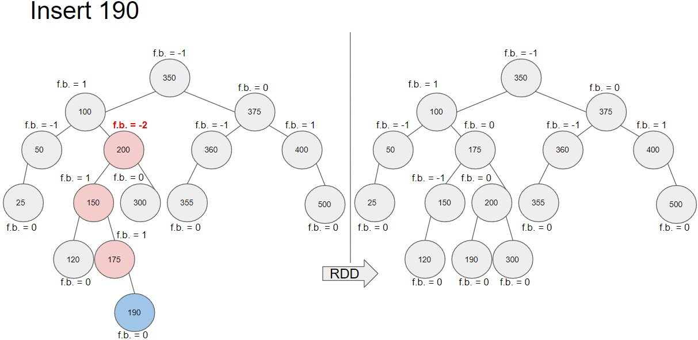


  * **Operaciones Delete**
  * delete(**100**)
  
    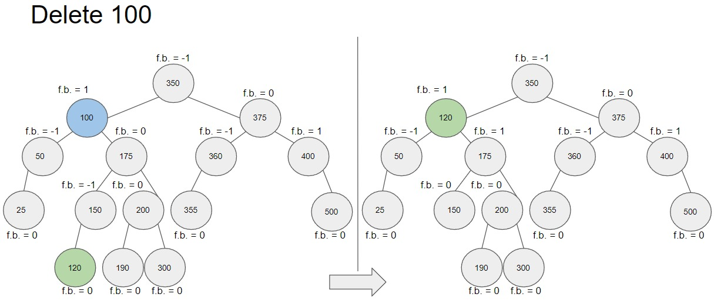

  * delete(**200**)
  
    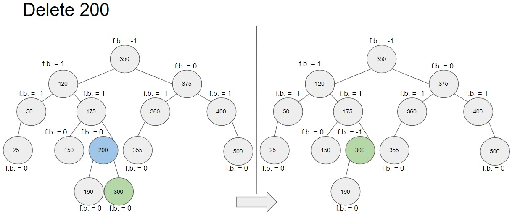

  * delete(**300**)
  
    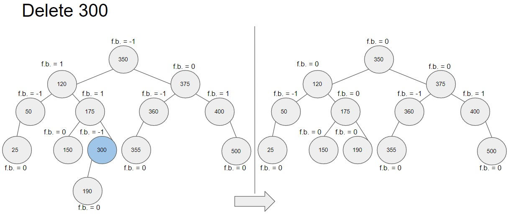

  * delete(**400**)
  
    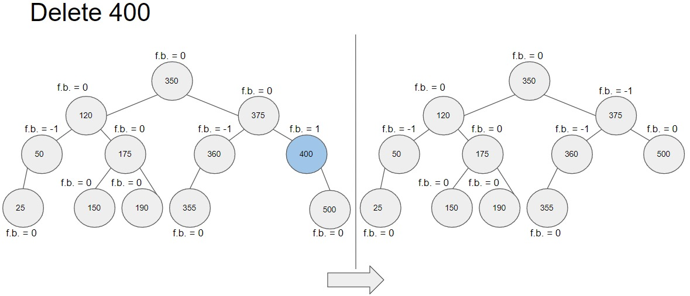

  * delete(**500**)
  
    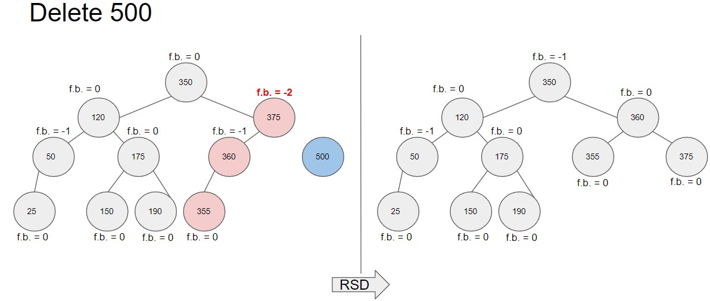

  * delete(**50**)
  
    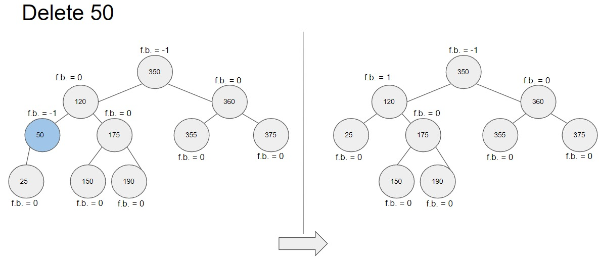

  * delete(**25**)
  
    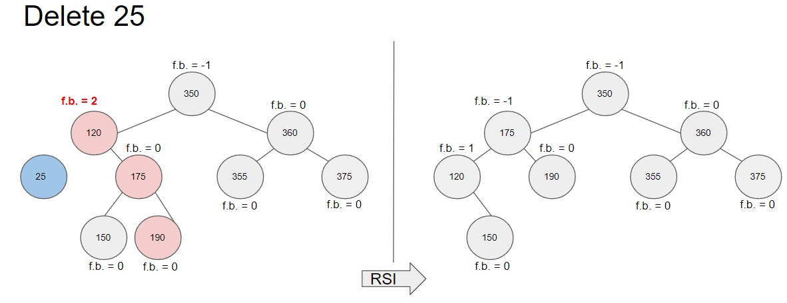

  * delete(**350**)
  
    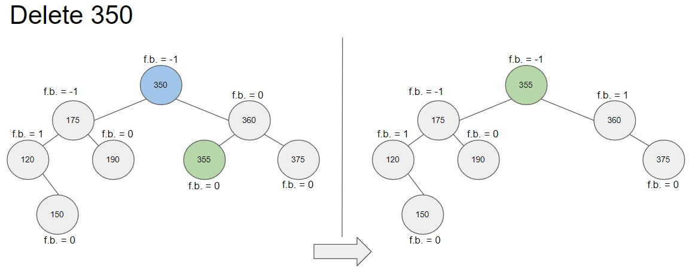

  * delete(**375**)
  
    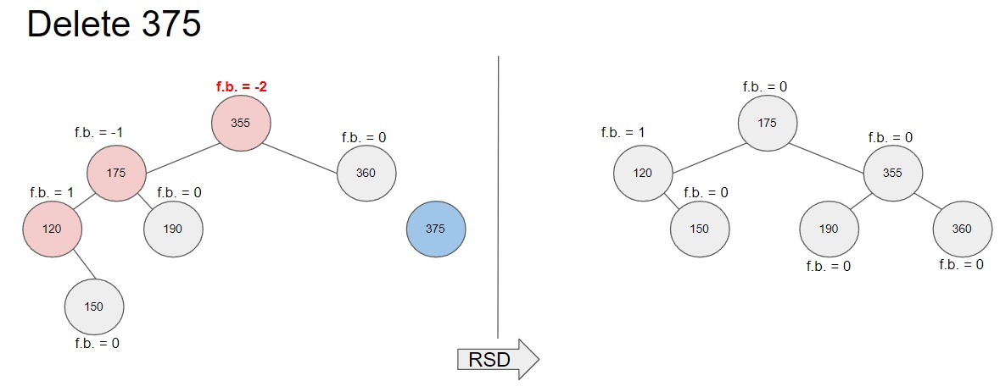

  * delete(**360**)
  
    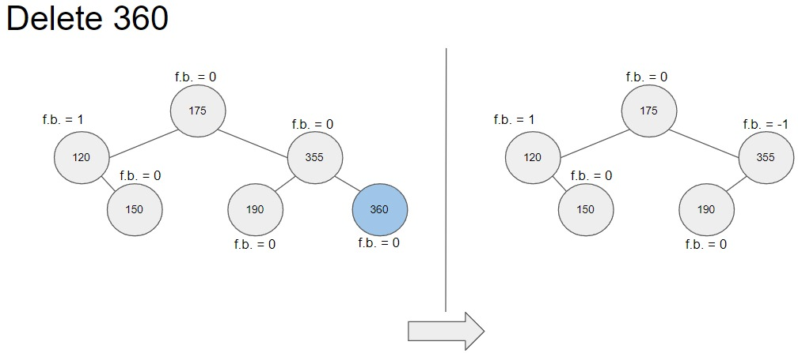

  * delete(**355**)
  
    

  * delete(**150**)
  
    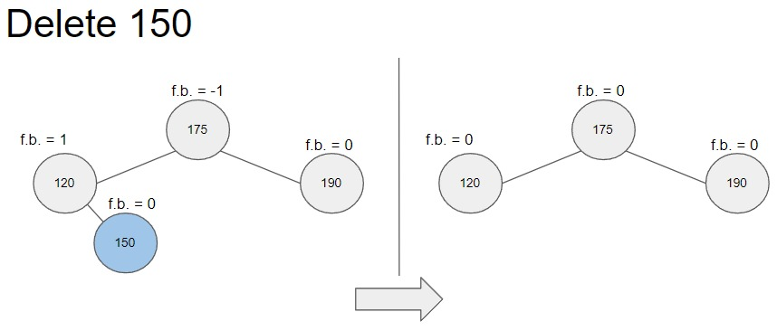

  * delete(**175**)
  
    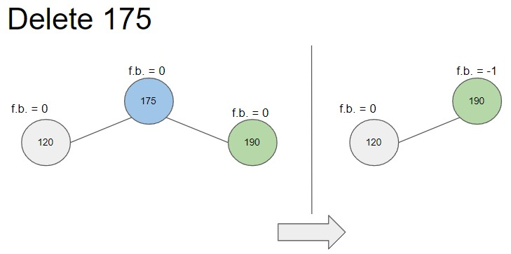

  * delete(**120**)
  
    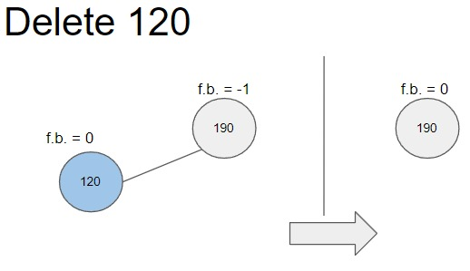

  * delete(**190**)
  
    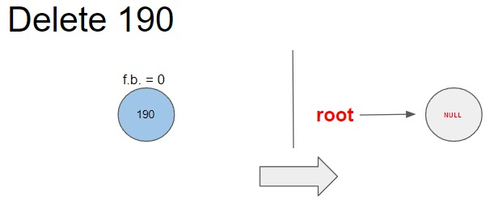


* **Ejercicio 3:** Árbol AVL
---

II. CONCLUSIONES
	
- 
	
---
    
## RETROALIMENTACIÓN GENERAL
 <pre>
 
 </pre>
---
    
### REFERENCIAS Y BIBLIOGRAFÍA
<ul>
    <li>https://www.w3schools.com/java/</li>
    <li>https://www.eclipse.org/downloads/packages/release/2022-03/r/eclipse-ide-enterprise-java-and-web-developers</li>
    <li>https://algorithmtutor.com/Data-Structures/Tree/AVL-Trees/</li>
    <li>https://docs.oracle.com/javase/tutorial/java/generics/types.html</li>
</ul>
